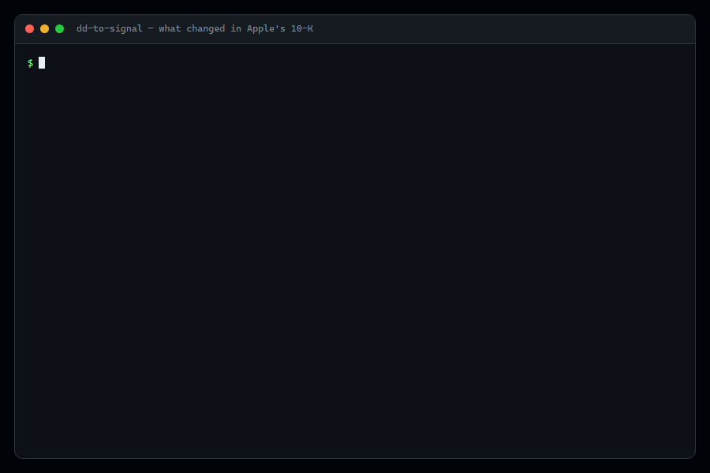
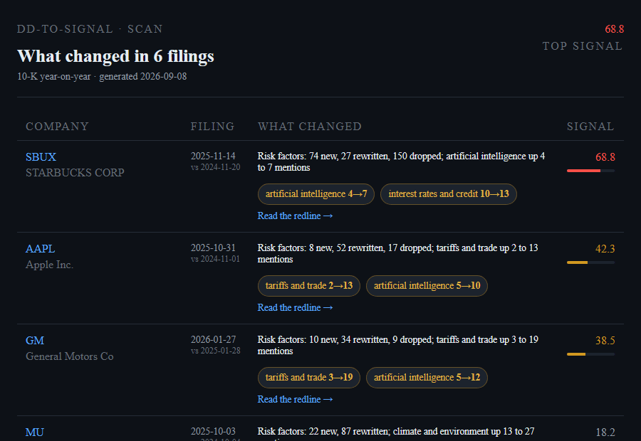

# dd-to-signal

[](https://github.com/GeoCodeCrafter/dd-to-signal/actions/workflows/ci.yml)
[](LICENSE)
[](pyproject.toml)

Every 10-K is a rewrite of last year's 10-K. **dd-to-signal** finds the edits.



```
$ pip install git+https://github.com/GeoCodeCrafter/dd-to-signal
$ dd-to-signal demo AAPL      # bundled filings, no network, no key
```

---

## The thing nobody reads

A company files its annual report once a year, and almost all of it is last
year's file with edits. Nobody diffs it. Analysts skim the new one, journalists
quote the scary paragraph, and the *changes* — the part that actually contains
information, because somebody sat in a room and decided to write it differently
this year — go unread.

They are not subtle when you look. Apple's FY2025 risk factors mention tariffs
**thirteen times**. The FY2024 filing mentioned them twice. General Motors went
from three to nineteen. Somebody rewrote those paragraphs on purpose, and the
rewrite was public the day it was filed.

That is all this tool does: fetch the last two filings, line the paragraphs up,
and show you what moved.

## Sixty seconds

```bash
pip install git+https://github.com/GeoCodeCrafter/dd-to-signal

dd-to-signal demo                    # six bundled companies, ranked
dd-to-signal demo AAPL               # one of them, in detail
dd-to-signal demo -o out --open      # the same thing as HTML
```

The demo runs **entirely offline** against real 10-Ks bundled in the package, so
nothing above needs a network connection, an API key or an account. When you
want live data, EDGAR is free and needs no key either:

```bash
dd-to-signal diff NVDA                          # last two 10-Ks
dd-to-signal diff TSLA --back 4                 # four year-on-year pairs
dd-to-signal diff MSFT --form 10-Q              # quarterlies work too
dd-to-signal scan AAPL NVDA GM F TGT -o out     # rank a basket
```

## What it produces

`-o` writes a self-contained HTML report per company and a ranked dashboard over
all of them. One file each, no CDN, no build step — the kind of thing you can
email to someone and still open in two years.



## What it found

Running `scan` over 21 large caps, comparing each company's two most recent
10-Ks. Every number below is reproducible with one command; none of it is
summarised or generated, it is counted.

| | Company | What changed |
| --- | --- | --- |
| **68.8** | Starbucks | 150 risk paragraphs dropped, 74 new — the section was rebuilt, not edited |
| **46.9** | Eli Lilly | 54 of its risk factors rewritten |
| **42.3** | Apple | tariffs 2 → 13 mentions; AI 5 → 10 |
| **38.5** | General Motors | tariffs 3 → 19 mentions |
| **31.6** | AMD | tariffs 7 → 19 mentions |
| **26.7** | Moderna | 120 risk factors rewritten; tariffs 2 → 12 |
| **18.2** | Micron | climate and environment 13 → 27 mentions |
| **15.9** | Target | tariffs 6 → 18 mentions |
| **12.4** | Delta | first ever mention of artificial intelligence in its risk factors |
| **3.2** | Costco | 22 paragraphs touched, nothing else |

The tariff column is the one that jumps out, and it is the same story in eleven
of the twenty-one: the language was already there, and it got promoted.

## How it works

Four steps, and the interesting problems are in the first two.

**1. Get the section.** The naive approach — find "Item 1A", slice to "Item 1B"
— fails on essentially every real filing, because the first "Item 1A" in the
document is the table of contents. Detecting the contents page is harder than it
sounds: proximity alone flags Apple, which stacks five empty items within twenty
blocks. So a contents page is identified by *shape* (an unbroken run of short
lines, which body prose always breaks) plus *redundancy* (its entries reappear
below). Filers that head the section "RISK FACTORS" with no item number at all —
Amazon, Walmart — are picked up by a title fallback.

**2. Line the paragraphs up.** A year-on-year filing diff is not a line diff.
Companies reorder risk factors, split one in two, promote a sub-point. Move a
paragraph from fourth to fortieth and `difflib` reports a deletion and an
unrelated addition. So this is a matching problem, solved cheapest-first: hash
the identical paragraphs (80–90% of them), then TF-IDF cosine similarity over
what is left, paired greedily above a threshold. Whatever fails to pair is a
real addition or deletion.

**3. Diff the words.** Standard sequence matching over tokens — but every span is
cut out of the source string by offset rather than rejoined from tokens. No set
of spacing rules survives a 10-K, which is full of `U.S.`, `$1.2 billion`,
`("EU")` and `Section 232(b)`. Slicing the original cannot get the spacing wrong,
because it never takes the spacing apart.

**4. Score it.** Text churn weighted towards risk factors, plus risk topics that
are new this year, plus a nudge for hedging language. The churn bounds are
calibrated against the real distribution — 21 large caps, median 41% year-on-year
churn in risk factors, quartiles at 28% and 48%. That floor matters: every
company rewrites something every year, so scoring raw churn puts the whole market
at the top of the scale and sorts nothing.

The score is **a sort order, not a prediction.** There are no fitted weights,
because there is no label to fit them against. It tells you which filing to read
first. It does not tell you what a stock will do, and anything claiming otherwise
about a 0-100 number derived from word counts is selling something.

## What it cannot read

Some filings genuinely cannot be diffed, and the tool says so rather than
reporting a confident zero. Of 24 large caps tested, 21 have readable risk
factors. The other three:

- **JPMorgan** files a wrapper: Item 1A is one sentence pointing at pages 9–31 of
  a document that is not this document. Reported as `by_reference`.
- **Intel** and **United Airlines** use heading structures the extractor does not
  yet recognise. Reported as `not_found`.

```bash
dd-to-signal sections JPM     # says exactly which sections it can see, and why
```

That distinction is the whole point of the command. "Nothing changed" and "we
could not read it" look identical in a dashboard that only counts words, and
conflating them is how a screening tool quietly starts lying to you.

Also worth knowing: pre-2001 filings are raw SGML and are skipped; amendments
(`10-K/A`) are excluded by default, because diffing one against a full 10-K
reports that the company deleted its entire risk factors section; and a ticker
maps to whichever entity currently holds it, so after a reorganisation the
history may sit under the predecessor's CIK, which you can pass directly
(`dd-to-signal diff CIK0000034088`).

## Commands

| | |
| --- | --- |
| `diff TICKER` | compare one company's last two filings |
| `scan TICKER...` | rank a basket by how much moved |
| `sections TICKER` | what can be read from a filing, and why the rest cannot |
| `demo [TICKER]` | the bundled filings, offline |
| `cache` | show or clear the download cache |

Useful flags: `--form 10-Q`, `--back N` for more history, `-o DIR` for HTML,
`--open`, `--offline`, `--limit N` to cap the changes rendered per section.

**On EDGAR etiquette.** SEC fair access requires a User-Agent with a contact
address and caps you at ten requests a second. This sits at six and caches every
document to disk, so a second run over the same filings does no network I/O at
all. Set your own contact with `DDSIGNAL_USER_AGENT="Your Name you@example.com"`.
Note the shape carefully: `www.sec.gov` returns 403 for any User-Agent containing
a URL, while `data.sec.gov` accepts them happily.

## The word lists are yours to change

Hedging, sentiment and the risk topics are plain text in
[`data/lexicons/`](data/lexicons/), not baked into the code, because the whole
project is a set of opinions about which words are worth counting and yours will
not be identical to mine. A topic needs two distinct terms to fire, or one marked
`!` as sufficient on its own — every 10-K in existence says "competition" once in
passing, and tagging on that makes the topic meaningless.

## Development

```bash
git clone https://github.com/GeoCodeCrafter/dd-to-signal
cd dd-to-signal
pip install -e ".[dev]"

pytest                            # 117 tests, no network needed
ruff check .

python scripts/build-samples.py   # refresh the bundled filings
npm install && npm run gif        # re-record the README GIFs
```

The tests run against the bundled filings, which are real 10-Ks, so they
exercise section location, alignment, scoring and rendering on documents written
by filing agents rather than by me. Both GIFs are generated by script from the
real output of the real command — if the tool breaks, they cannot be recorded.

## Licence

MIT. Filing text belongs to the filers; this tool only diffs it.
